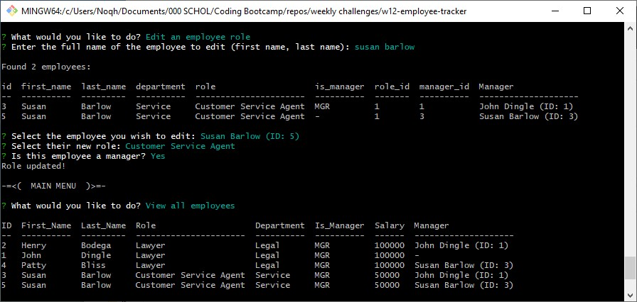

# Employee Tracker
A command-line CMS to manage your employees.

## Installation
This software uses MySQL to create its database. You'll need MySQL installed on your computer or this program won't work. You can download the MySQL Shell [here](https://dev.mysql.com/downloads/shell/).

Check out [this video](https://youtu.be/A440kEjFps4) for an in-depth guide I made on installing and utilizing this software. Or if you prefer, you can follow these written instructions:

1. Clone/fork this repo
2. Open the `.env.EXAMPLE` file in a text editor, put your MySQL username and password into the `DB_USER` and `DB_PASSWORD` fields. You'll need to also change the `DB_NAME` field if you already have a MySQL database called "employee_db".
3. Once you have your credentials in there, save the file and rename it to just `.env`
4. Open a terminal in the repo folder on your computer.
5. Enter `npm i` to install the project dependencies (which for this project are dotenv, mysql2, inquirer, and console.table)
6. We're ready to start!

## Usage

When you run the program for the first time, the database will be empty. The only option we can select now is "Add a department". Once you've created one, you can now add Roles. Once you've added one or more roles, you can add Employees. That is the structure the database follows. All employees must have a role, and all roles must have a department.

You can also edit an employee's role.
1. Select "Edit an employee role" from the main menu
2. Enter the first and last name, separated by a space, of the employee you wish to edit.
3. If an employee is found, you can update the Role and the Manager status of that employee
4. If you wish to promote them to manager but keep their role the same, simply select the role they already have from the list, and when it asks if they are a manager, select "Yes". The database will update accordingly.

## Limitations

This program cannot:
- Delete departments, roles, or employees
- Edit department names, role names, role salaries, or employee names retroactively
- Change or remove an employee's manager
- Add new columns to a table's definition

## What I Learned

Working on this project made me much more comfortable with MySQL stuff, specifically table joins, select queries, and aliases. Once I understood things, it was much easier to put the program together.

## How To Contribute

I probably won't revisit this project to fix its limitations, but if you're itching to fix some code, then by all means fork this repository and send some pull requests. I'm open to collaboration.
You can also contribute by posting bug reports. Screenshots of errors in your terminal work fine, just take one and [post it in a new Issue on this repository](https://github.com/Sumtwelve/employee-tracker/issues/new).

## License

Copyright 2023 Sumtwelve / Noah Nielsen

Permission is hereby granted, free of charge, to any person obtaining a copy of this software and associated documentation files (the “Software”), to deal in the Software without restriction, including without limitation the rights to use, copy, modify, merge, publish, distribute, sublicense, and/or sell copies of the Software, and to permit persons to whom the Software is furnished to do so, subject to the following conditions:

The above copyright notice and this permission notice shall be included in all copies or substantial portions of the Software.

THE SOFTWARE IS PROVIDED “AS IS”, WITHOUT WARRANTY OF ANY KIND, EXPRESS OR IMPLIED, INCLUDING BUT NOT LIMITED TO THE WARRANTIES OF MERCHANTABILITY, FITNESS FOR A PARTICULAR PURPOSE AND NONINFRINGEMENT. IN NO EVENT SHALL THE AUTHORS OR COPYRIGHT HOLDERS BE LIABLE FOR ANY CLAIM, DAMAGES OR OTHER LIABILITY, WHETHER IN AN ACTION OF CONTRACT, TORT OR OTHERWISE, ARISING FROM, OUT OF OR IN CONNECTION WITH THE SOFTWARE OR THE USE OR OTHER DEALINGS IN THE SOFTWARE.
